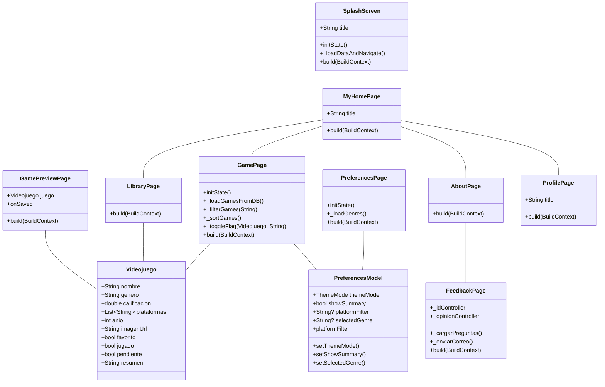

# Game Gauge

## Indice

- [Datos del creador](#datos-del-creador)

- [Descripción del proyecto](#descripción-del-proyecto)

- [Lista de características](#lista-de-características)
- [Lista de funcionalidades más relevantes](#lista-de-funcionalidades-más-relevantes)
- [Recursos generados](#recursos-generados)

## Datos del creador

- **Nombre**: José Peña.

- **Universidad**: Universidad de Talca.

- **Carrera**: Ingeniera en desarrollo de videojuegos y realidad virtual.

- **Modulo**: Programacion para dispositivos moviles.

- **Profesor**: Manuel Moscoso.

## Descripción del proyecto 
Game Gauge es una aplicación móvil desarrollada en Flutter que permite a los usuarios explorar información sobre videojuegos. La aplicación ofrece una interfaz intuitiva para buscar, descubrir y gestionar una biblioteca personal de videojuegos. 
## Lista de características 
- **Splash Screen**: Pantalla de inicio que muestra el logo y nombre de la aplicación. 
- **Home Screen**: Pantalla principal con una lista de los últimos éxitos y los juegos más esperados. 
- **Navegación**: Menú lateral para navegar entre las diferentes secciones de la aplicación (Perfil, Explorar juegos, Mi biblioteca). 
- **Perfil de Usuario**: Pantalla que muestra la información del usuario, incluyendo juegos gustados, por jugar y jugados. 
- **Explorar Juegos**: Pantalla para buscar videojuegos con filtrado y ordenamiento por calificación. 
- **Biblioteca**: Sección para gestionar los juegos favoritos, guardados y completados del usuario. 
- **Detalle del Videojuego**: Visualización de información detallada de cada juego (nombre, género, calificación, plataformas, año). 
- **Tarjeta de Videojuego**: Widget reutilizable para mostrar información resumida de un videojuego (imagen, nombre, calificación). 
## Lista de funcionalidades más relevantes 
- **Búsqueda y filtrado de videojuegos**: Los usuarios pueden buscar videojuegos por nombre y ordenar los resultados por calificación. 
- **Gestión de la biblioteca personal**: La aplicación permite a los usuarios marcar juegos como favoritos, guardados o completados. 
- **Visualización de detalles del videojuego**: Los usuarios pueden ver información detallada sobre cada videojuego. 
- **Navegación intuitiva**: La aplicación ofrece una navegación fácil de usar a través de un menú lateral y una estructura de pestañas en la biblioteca. 
- **Interfaz de usuario atractiva**: Diseño moderno y atractivo con uso de imágenes, íconos y tarjetas informativas. 
## Capturas de pantalla 

## Descargar la app

Puedes probar la aplicación descargando el APK:

[ Descargar APK (v1.0.0)](https://github.com/xWTomasWx/VideogameRating/releases/download/v1.0.0/game_gauge.apk)
## Recursos generados 
- [Enlace del proyecto en github](https://github.com/xWTomasWx/VideogameRating)
- [Enlace presentación](https://drive.google.com/file/d/1X0jYLj_HepNChIGcx9ltIi3TE5Sxsyjs/view?usp=sharing)
- [Enlace video](https://youtu.be/XZcuN1ufnz8)
- **Diagrama de clases:**
